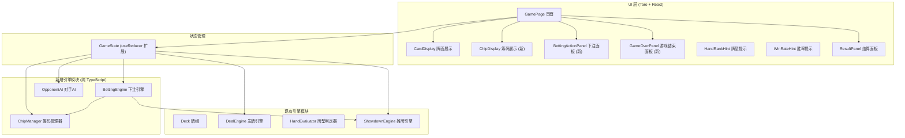
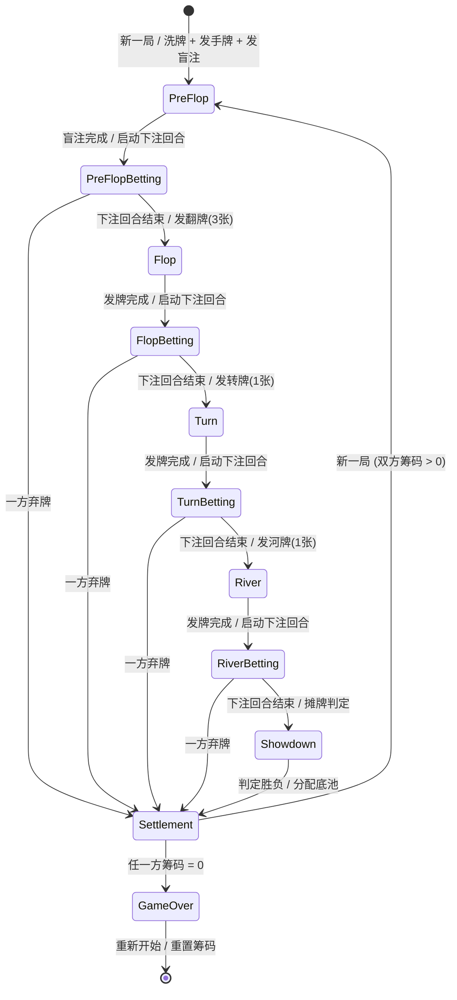
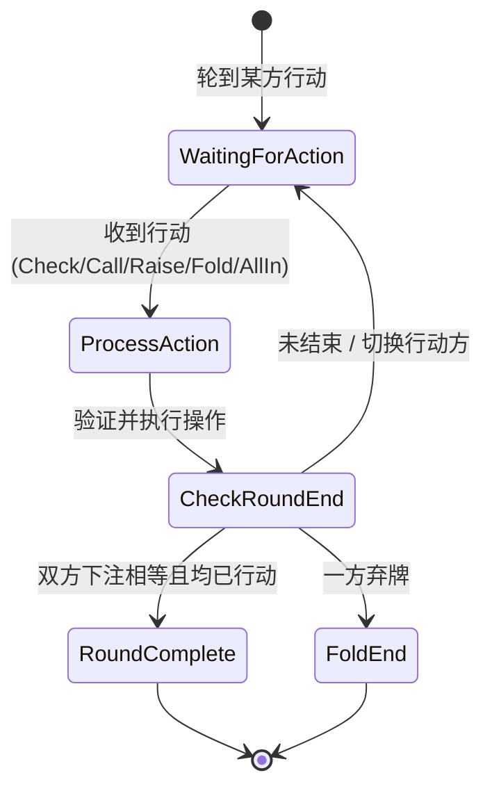

# 技术方案设计文档

## 概述

筹码与下注系统在现有德州扑克模拟训练器基础上，增加筹码管理和下注交互层。系统为玩家和对手各分配 100 个初始筹码，在每个牌局阶段（翻牌前、翻牌、转牌、河牌）的发牌完成后插入标准下注回合。玩家可执行加注（Raise）、跟注（Call）、弃牌（Fold）、过牌（Check）和全下（All-In）操作；对手使用基于概率的简单 AI 策略自动决策。牌局结束后根据胜负分配底池筹码，任一方筹码归零时游戏结束。

### 设计决策

1. **引擎与 UI 分离（延续现有架构）**：ChipManager、BettingEngine、OpponentAI 作为纯函数/类实现，不依赖 React 或 Taro API，便于独立测试
2. **可注入随机数生成器**：OpponentAI 接受外部注入的随机数生成函数，测试时可使用确定性种子控制决策结果
3. **扩展现有 Reducer 模式**：在现有 `gameFlowReducer` 基础上扩展下注相关的 action 和状态，保持单一状态树管理
4. **纯函数式状态转换**：BettingEngine 的核心逻辑（验证操作、计算扣减、推进回合）均为纯函数，接收当前状态返回新状态，便于属性测试
5. **盲注位置交替**：使用 `handNumber` 计数器追踪牌局序号，奇偶性决定盲注位置分配

## 架构

### 整体架构



### 牌局流程状态机（含下注回合）



### 下注回合内部流程



## 组件与接口

### 新增引擎模块

#### 1. ChipManager（筹码管理器）

```typescript
// 文件: src/engine/chipManager.ts

interface ChipState {
  playerChips: number;    // 玩家筹码余额
  opponentChips: number;  // 对手筹码余额
}

/** 创建初始筹码状态 */
function createChipState(initialChips?: number): ChipState;

/** 从指定方扣减筹码，返回新状态。扣减金额不超过当前余额 */
function deductChips(state: ChipState, who: 'player' | 'opponent', amount: number): ChipState;

/** 将底池筹码分配给获胜方，返回新状态 */
function awardPot(state: ChipState, winner: 'player' | 'opponent', potAmount: number): ChipState;

/** 平局分配底池：平分筹码，无法整除时多余 1 个给小盲注方 */
function splitPot(state: ChipState, potAmount: number, smallBlind: 'player' | 'opponent'): ChipState;

/** 检查是否有一方筹码归零 */
function isGameOver(state: ChipState): boolean;
```

#### 2. BettingEngine（下注引擎）

```typescript
// 文件: src/engine/bettingEngine.ts

/** 下注操作类型 */
type BettingActionType = 'check' | 'call' | 'raise' | 'fold' | 'all_in';

/** 下注操作 */
interface BettingAction {
  type: BettingActionType;
  amount: number;  // 本次操作实际投入底池的筹码数
}

/** 下注回合状态 */
interface BettingRoundState {
  pot: number;                          // 当前底池总额
  playerRoundBet: number;              // 玩家本回合已下注金额
  opponentRoundBet: number;            // 对手本回合已下注金额
  currentActor: 'player' | 'opponent'; // 当前行动方
  playerActed: boolean;                // 玩家本回合是否已行动
  opponentActed: boolean;              // 对手本回合是否已行动
  roundEnded: boolean;                 // 本回合是否结束
  foldedBy: 'player' | 'opponent' | null; // 弃牌方
  lastRaiseAmount: number;             // 上一次加注的增量（用于最小加注计算）
}

/** 创建新的下注回合状态 */
function createBettingRound(
  pot: number,
  firstActor: 'player' | 'opponent',
): BettingRoundState;

/** 获取当前行动方可用的操作列表 */
function getAvailableActions(
  roundState: BettingRoundState,
  actorChips: number,
  minRaise: number,
): BettingActionType[];

/** 验证并执行下注操作，返回新的回合状态和筹码变动 */
function executeBettingAction(
  roundState: BettingRoundState,
  chipState: ChipState,
  action: BettingAction,
  minRaise: number,
): { roundState: BettingRoundState; chipState: ChipState };

/** 发放盲注，返回更新后的筹码状态和底池金额 */
function postBlinds(
  chipState: ChipState,
  smallBlind: 'player' | 'opponent',
  smallBlindAmount: number,
  bigBlindAmount: number,
): { chipState: ChipState; pot: number; playerRoundBet: number; opponentRoundBet: number };

/** 检查下注回合是否应该结束 */
function isRoundComplete(roundState: BettingRoundState): boolean;
```

#### 3. OpponentAI（对手 AI）

```typescript
// 文件: src/engine/opponentAI.ts

/** 随机数生成器类型（返回 0-1 之间的浮点数） */
type RandomGenerator = () => number;

/** AI 决策结果 */
interface AIDecision {
  action: BettingAction;
}

/** 根据当前状态和策略做出下注决策 */
function makeDecision(
  roundState: BettingRoundState,
  opponentChips: number,
  minRaise: number,
  rng: RandomGenerator,
): AIDecision;
```

### 扩展现有模块

#### 4. 扩展 GameStateData（游戏状态）

```typescript
// 扩展 src/engine/types.ts

/** 扩展后的游戏阶段，增加下注子阶段 */
type BettingPhase = 'pre_flop_betting' | 'flop_betting' | 'turn_betting' | 'river_betting';
type ExtendedGamePhase = GamePhase | BettingPhase | 'game_over';

/** 扩展后的游戏状态 */
interface ExtendedGameStateData extends GameStateData {
  phase: ExtendedGamePhase;
  chipState: ChipState;
  bettingRound: BettingRoundState | null;
  handNumber: number;           // 牌局序号（从 1 开始，用于盲注位置交替）
  isGameOver: boolean;
  gameOverWinner: 'player' | 'opponent' | null;
}
```

#### 5. 扩展 useGameFlow Hook

```typescript
// 扩展 src/hooks/useGameFlow.ts

// 新增 Action Types
type BettingGameAction =
  | GameAction
  | { type: 'PLAYER_BET'; action: BettingAction }
  | { type: 'OPPONENT_BET' }
  | { type: 'START_BETTING_ROUND' }
  | { type: 'RESTART_GAME' };

interface ExtendedUseGameFlowReturn extends UseGameFlowReturn {
  placeBet(action: BettingAction): void;   // 玩家下注
  restartGame(): void;                      // 重新开始游戏（重置筹码）
}
```

### 新增 UI 组件

#### 6. ChipDisplay（筹码展示组件）

```typescript
// 文件: src/components/ChipDisplay/index.tsx

interface ChipDisplayProps {
  playerChips: number;
  opponentChips: number;
  pot: number;
}
```

#### 7. BettingActionPanel（下注操作面板）

```typescript
// 文件: src/components/BettingActionPanel/index.tsx

interface BettingActionPanelProps {
  availableActions: BettingActionType[];
  currentBetToCall: number;     // 当前需要跟注的金额
  minRaiseAmount: number;       // 最小加注金额
  maxRaiseAmount: number;       // 最大加注金额（玩家当前筹码）
  enabled: boolean;             // 是否启用（轮到玩家行动时启用）
  onAction: (action: BettingAction) => void;
}
```

#### 8. GameOverPanel（游戏结束面板）

```typescript
// 文件: src/components/GameOverPanel/index.tsx

interface GameOverPanelProps {
  winner: 'player' | 'opponent';
  playerChips: number;
  opponentChips: number;
  onRestart: () => void;
}
```

## 数据模型

### ChipState（筹码状态）

| 字段 | 类型 | 说明 |
|------|------|------|
| playerChips | number | 玩家筹码余额，非负整数 |
| opponentChips | number | 对手筹码余额，非负整数 |

### BettingRoundState（下注回合状态）

| 字段 | 类型 | 说明 |
|------|------|------|
| pot | number | 当前底池总额 |
| playerRoundBet | number | 玩家本回合已下注金额 |
| opponentRoundBet | number | 对手本回合已下注金额 |
| currentActor | 'player' \| 'opponent' | 当前行动方 |
| playerActed | boolean | 玩家本回合是否已行动 |
| opponentActed | boolean | 对手本回合是否已行动 |
| roundEnded | boolean | 本回合是否结束 |
| foldedBy | 'player' \| 'opponent' \| null | 弃牌方，null 表示无人弃牌 |
| lastRaiseAmount | number | 上一次加注的增量 |

### BettingAction（下注操作）

| 字段 | 类型 | 说明 |
|------|------|------|
| type | BettingActionType | 操作类型: check / call / raise / fold / all_in |
| amount | number | 本次操作实际投入底池的筹码数 |

### ExtendedGameStateData（扩展游戏状态）

| 字段 | 类型 | 说明 |
|------|------|------|
| （继承 GameStateData 所有字段） | | |
| phase | ExtendedGamePhase | 扩展阶段，含下注子阶段和 game_over |
| chipState | ChipState | 双方筹码状态 |
| bettingRound | BettingRoundState \| null | 当前下注回合状态，非下注阶段为 null |
| handNumber | number | 牌局序号，从 1 开始递增 |
| isGameOver | boolean | 游戏是否结束 |
| gameOverWinner | 'player' \| 'opponent' \| null | 游戏结束时的获胜方 |

### 常量定义

| 常量 | 值 | 说明 |
|------|------|------|
| INITIAL_CHIPS | 100 | 初始筹码数 |
| SMALL_BLIND_AMOUNT | 1 | 小盲注金额 |
| BIG_BLIND_AMOUNT | 2 | 大盲注金额 |
| MIN_RAISE | 2 | 最小加注额（等于大盲注） |
| AI_DELAY_MS | 500 | AI 决策延迟毫秒数 |


## 正确性属性

*属性（Property）是指在系统所有有效执行中都应成立的特征或行为——本质上是对系统应做什么的形式化陈述。属性是人类可读规范与机器可验证正确性保证之间的桥梁。*

### 属性 1：筹码非负不变量

*对于任意*初始筹码状态和任意合法的下注操作序列（包括盲注、Call、Raise、All-In），执行操作后双方的筹码余额均应为非负整数。

**验证需求：1.2, 1.6**

### 属性 2：筹码守恒

*对于任意*初始筹码状态和任意合法的下注操作序列，双方筹码余额之和加上当前底池金额应始终等于初始筹码总和（200）。即系统中筹码总量不变。

**验证需求：1.3, 6.2, 6.6**

### 属性 3：平局底池分配正确性

*对于任意*底池金额和小盲注方标识，`splitPot` 应使双方各获得 `floor(pot/2)` 个筹码，当底池为奇数时，多余的 1 个筹码应分配给小盲注方。

**验证需求：1.5**

### 属性 4：盲注发放正确性

*对于任意*筹码状态（双方筹码均 > 0），执行 `postBlinds` 后：小盲注方筹码减少 `min(1, 小盲注方余额)`，大盲注方筹码减少 `min(2, 大盲注方余额)`，底池增加量等于双方筹码减少量之和。

**验证需求：2.1, 2.2, 2.4, 2.5**

### 属性 5：盲注位置交替

*对于任意*牌局序号 `handNumber`，当 `handNumber` 为奇数时玩家为小盲注方，当 `handNumber` 为偶数时对手为小盲注方。

**验证需求：2.3**

### 属性 6：可用操作正确性

*对于任意*下注回合状态和行动方筹码余额：当存在未匹配下注（对方下注 > 己方下注）时，可用操作应包含 Call（或 All-In，当筹码不足时）、Raise 和 Fold；当无未匹配下注时，可用操作应包含 Check 和 Raise。

**验证需求：4.1, 4.2, 4.7**

### 属性 7：下注回合结束条件

*对于任意*下注回合状态，当且仅当以下条件之一满足时回合应结束：(a) 双方均已行动至少一次且双方本回合下注金额相等；(b) 一方选择了 Fold。

**验证需求：3.4, 3.6**

### 属性 8：行动权交替

*对于任意*下注回合中的非终结操作（Check、Call、Raise），执行后 `currentActor` 应切换为另一方。

**验证需求：3.3, 4.6**

### 属性 9：弃牌立即结束牌局

*对于任意*下注回合状态，当一方执行 Fold 操作后，`foldedBy` 应设为该方，`roundEnded` 应为 true，底池应分配给未弃牌方。

**验证需求：3.5, 4.5, 6.4**

### 属性 10：加注金额验证

*对于任意*加注操作，若加注增量（超出跟注金额的部分）小于 `MIN_RAISE`（2 个筹码），则该操作应被拒绝（除非是 All-In）。

**验证需求：4.4, 4.8**

### 属性 11：AI 决策与随机数的确定性映射

*对于任意* RNG 返回值 `r ∈ [0, 1)` 和下注回合状态：当无未匹配下注时，`r < 0.7` 应产生 Check，`r >= 0.7` 应产生 Raise；当存在未匹配下注时，`r < 0.6` 应产生 Call，`0.6 <= r < 0.8` 应产生 Raise，`r >= 0.8` 应产生 Fold。

**验证需求：5.2, 5.3**

### 属性 12：游戏结束检测

*对于任意*筹码状态，`isGameOver` 返回 true 当且仅当 `playerChips === 0` 或 `opponentChips === 0`。

**验证需求：9.1**

### 属性 13：阶段序列含下注回合

*对于任意*完整牌局（无弃牌），阶段推进顺序应为：pre_flop → pre_flop_betting → flop → flop_betting → turn → turn_betting → river → river_betting → showdown。每个发牌阶段后必须经过对应的下注阶段才能推进到下一个发牌阶段。

**验证需求：3.1, 10.1, 10.2, 10.5**

### 属性 14：新一局重置下注状态

*对于任意*处于任何阶段的游戏状态，开始新一局后：底池应为盲注总额（非 0，因为已发放盲注）、下注回合状态应为新的翻牌前下注回合、`handNumber` 应递增 1、双方筹码应反映盲注扣减。

**验证需求：10.4**

## 错误处理

### 下注操作错误

| 场景 | 处理方式 |
|------|----------|
| 加注金额小于最小加注额 | 抛出 `BettingError`，包含 "Raise amount below minimum" 描述 |
| 下注金额超过玩家筹码余额 | 自动转换为 All-In 操作 |
| 非当前行动方尝试操作 | 忽略操作，保持当前状态 |
| 在非下注阶段尝试下注 | 忽略操作，保持当前状态 |

### 筹码管理错误

| 场景 | 处理方式 |
|------|----------|
| 扣减金额超过当前余额 | 扣减实际余额（即 All-In），不抛出错误 |
| 负数金额的扣减请求 | 抛出 `ChipError`，包含 "Invalid deduction amount" 描述 |

### 游戏流程错误

| 场景 | 处理方式 |
|------|----------|
| 游戏结束状态下尝试开始新一局 | 忽略操作，需通过"重新开始"按钮重置 |
| 下注回合进行中调用 nextStep | 忽略操作，保持当前状态 |

### 自定义错误类

```typescript
export class BettingError extends Error {
  constructor(message: string) {
    super(message);
    this.name = 'BettingError';
  }
}

export class ChipError extends Error {
  constructor(message: string) {
    super(message);
    this.name = 'ChipError';
  }
}
```

## 测试策略

### 测试框架

- **单元测试**: Jest（延续现有项目配置）
- **属性测试**: fast-check（延续现有项目配置）

### 双重测试方法

本功能采用单元测试与属性测试互补的策略：

- **单元测试**：验证具体示例、边界情况和错误条件
  - 初始筹码分配为 100
  - 盲注不足时的 All-In 盲注场景
  - AI 在筹码不足时选择 All-In 或 Fold 的具体概率
  - 底池重置为 0 的具体场景
  - 游戏结束后重新开始重置筹码为 100
  - 无效加注金额的错误消息
  - UI 组件在各状态下的渲染（按钮启用/禁用、面板显示/隐藏）

- **属性测试**：验证跨所有输入的通用属性
  - 每个属性测试对应设计文档中的一个正确性属性
  - 每个属性测试至少运行 100 次迭代
  - 使用 fast-check 的 `fc.assert` 和 `fc.property` API
  - 需要自定义生成器：ChipState 生成器、BettingRoundState 生成器、BettingAction 生成器、RNG 值生成器

### 属性测试标签格式

每个属性测试必须包含注释引用设计文档中的属性：

```typescript
// Feature: chip-betting-system, Property 1: 筹码非负不变量
test('chip balances remain non-negative after any valid action sequence', () => {
  fc.assert(
    fc.property(chipStateArb, actionSequenceArb, (chipState, actions) => {
      // ...
    }),
    { numRuns: 100 }
  );
});
```

### 自定义生成器

```typescript
// ChipState 生成器
const chipStateArb: fc.Arbitrary<ChipState> = fc.record({
  playerChips: fc.integer({ min: 0, max: 200 }),
  opponentChips: fc.integer({ min: 0, max: 200 }),
});

// 正数 ChipState 生成器（双方筹码 > 0，用于下注测试）
const activeChipStateArb: fc.Arbitrary<ChipState> = fc.record({
  playerChips: fc.integer({ min: 1, max: 200 }),
  opponentChips: fc.integer({ min: 1, max: 200 }),
});

// BettingAction 生成器
const bettingActionArb: fc.Arbitrary<BettingAction> = fc.oneof(
  fc.constant({ type: 'check' as const, amount: 0 }),
  fc.constant({ type: 'fold' as const, amount: 0 }),
  fc.integer({ min: 2, max: 100 }).map(amount => ({ type: 'raise' as const, amount })),
  fc.integer({ min: 1, max: 100 }).map(amount => ({ type: 'call' as const, amount })),
);

// RNG 值生成器
const rngValueArb: fc.Arbitrary<number> = fc.double({ min: 0, max: 1, noNaN: true });

// 底池金额生成器
const potArb: fc.Arbitrary<number> = fc.integer({ min: 0, max: 200 });
```

### 测试覆盖范围

| 模块 | 单元测试 | 属性测试 |
|------|----------|----------|
| ChipManager | 初始化、All-In 盲注边界 | 属性 1, 2, 3 |
| BettingEngine (盲注) | 盲注不足场景 | 属性 4, 5 |
| BettingEngine (操作) | 无效加注错误 | 属性 6, 7, 8, 10 |
| BettingEngine (弃牌) | 弃牌后底池分配 | 属性 9 |
| OpponentAI | 筹码不足时的决策 | 属性 11 |
| GameFlow (结束) | 重新开始重置 | 属性 12 |
| GameFlow (阶段) | 完整牌局流程 | 属性 13, 14 |
| ChipDisplay | 各状态渲染 | — |
| BettingActionPanel | 按钮启用/禁用 | — |
| GameOverPanel | 面板显示 | — |
