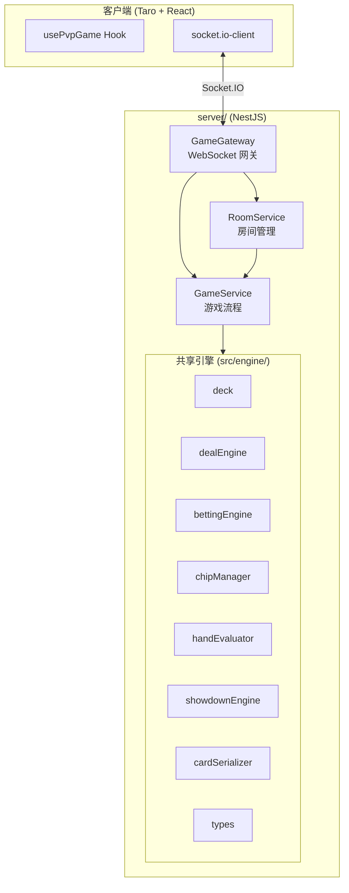

# 设计文档：NestJS PVP 后端

## 概述

本设计将现有德州扑克训练器的客户端引擎逻辑迁移至 NestJS + Socket.IO 后端，构建权威服务器模式的 1v1 PVP 对战系统。服务端在 `server/` 目录下作为独立 NestJS 项目运行，通过 TypeScript 路径别名共享 `src/engine/` 中的纯函数模块（deck、dealEngine、handEvaluator、showdownEngine、bettingEngine、chipManager、cardSerializer）。

核心设计原则：
- 服务端权威：所有游戏逻辑（洗牌、发牌、下注验证、摊牌判定）在服务端执行
- Client_View 过滤：每次状态变更后生成玩家视角的视图，隐藏对手手牌和剩余牌组
- 房间隔离：通过 Socket.IO Room 机制实现房间级别的事件隔离
- 断线容错：120 秒重连窗口，会话保持

## 架构



### 目录结构

```
server/
├── package.json
├── tsconfig.json
├── nest-cli.json
├── src/
│   ├── main.ts                    # 入口，配置端口和 CORS
│   ├── app.module.ts              # 根模块
│   ├── game/
│   │   ├── game.module.ts
│   │   ├── game.gateway.ts        # WebSocket 网关，事件路由
│   │   ├── game.service.ts        # 游戏流程管理
│   │   ├── room.service.ts        # 房间管理
│   │   └── interfaces.ts          # 服务端专用类型
│   └── shared/
│       └── engine.ts              # 重导出共享引擎模块
└── test/
    ├── game.service.spec.ts
    ├── room.service.spec.ts
    └── game.gateway.spec.ts
```

### 引擎共享策略

服务端通过 `tsconfig.json` 中的路径别名引用项目根目录的 `src/engine/`：

```json
{
  "compilerOptions": {
    "paths": {
      "@engine/*": ["../src/engine/*"]
    }
  }
}
```

这样 `server/` 可以直接 `import { createDeck, shuffle } from '@engine/deck'` 复用所有纯函数模块，无需复制代码。

## 组件与接口

### 1. GameGateway（WebSocket 网关）

职责：处理 Socket.IO 连接/断开、事件路由、输入校验。

```typescript
@WebSocketGateway({ cors: { origin: process.env.CORS_ORIGIN || '*' } })
class GameGateway implements OnGatewayConnection, OnGatewayDisconnect {
  // 客户端事件处理
  handleConnection(client: Socket): void;
  handleDisconnect(client: Socket): void;
  
  @SubscribeMessage('createRoom')
  handleCreateRoom(client: Socket): void;
  
  @SubscribeMessage('joinRoom')
  handleJoinRoom(client: Socket, data: { roomCode: string }): void;
  
  @SubscribeMessage('placeBet')
  handlePlaceBet(client: Socket, data: { type: string; amount: number }): void;
  
  @SubscribeMessage('restartGame')
  handleRestartGame(client: Socket): void;
  
  @SubscribeMessage('reconnect')
  handleReconnect(client: Socket, data: { roomCode: string; oldSocketId: string }): void;
}
```

输入校验规则：
- `placeBet`：`type` 必须为合法的 `BettingActionType`，`amount` 必须为非负整数
- `joinRoom`：`roomCode` 必须为 6 位大写字母
- `reconnect`：`roomCode` 和 `oldSocketId` 必须为非空字符串
- 所有游戏操作事件需验证发送者是否为房间成员

### 2. RoomService（房间管理服务）

职责：房间生命周期管理、房间码生成、玩家会话管理。

```typescript
class RoomService {
  private rooms: Map<string, Room>;
  
  createRoom(socketId: string): { roomCode: string; role: string };
  joinRoom(socketId: string, roomCode: string): { role: string } | { error: string };
  findRoomBySocketId(socketId: string): Room | undefined;
  handleDisconnect(socketId: string): { room: Room; role: string } | undefined;
  handleReconnect(roomCode: string, oldSocketId: string, newSocketId: string): boolean;
  destroyRoom(roomCode: string): void;
  generateRoomCode(): string;  // 6位大写字母，不重复
}
```

### 3. GameService（游戏流程服务）

职责：封装游戏引擎调用，管理游戏状态转换，生成 Client_View。

```typescript
class GameService {
  initializeGame(room: Room): void;
  placeBet(room: Room, socketId: string, action: BettingAction): { error?: string };
  restartGame(room: Room, socketId: string): { error?: string };
  getClientView(room: Room, role: 'player' | 'opponent'): ClientView;
}
```

## 数据模型

### Room（房间）

```typescript
interface Room {
  roomCode: string;
  players: {
    player?: PlayerSession;
    opponent?: PlayerSession;
  };
  gameState: ExtendedGameStateData | null;
  status: 'waiting' | 'playing' | 'finished';
  createdAt: number;
  lastActivityAt: number;
}
```

### PlayerSession（玩家会话）

```typescript
interface PlayerSession {
  socketId: string;
  role: 'player' | 'opponent';
  connected: boolean;
  disconnectedAt: number | null;
}
```

### ClientView（客户端视图）

```typescript
interface ClientView {
  roomCode: string;
  myRole: 'player' | 'opponent';
  myHand: Card[];
  opponentHand: Card[] | null;       // 仅摊牌阶段非 null
  phase: ExtendedGamePhase;
  communityCards: Card[];
  chipState: ChipState;
  bettingRound: BettingRoundState | null;
  handNumber: number;
  isGameOver: boolean;
  gameOverWinner: 'player' | 'opponent' | null;
  actionLog: ActionLogEntry[];
  showdownResult: ShowdownResult | null;
  currentActor: 'player' | 'opponent' | null;
  availableActions: BettingActionType[];
  opponentConnected: boolean;
}
```

### 事件协议

| 方向 | 事件名 | 载荷 |
|------|--------|------|
| C→S | `createRoom` | 无 |
| C→S | `joinRoom` | `{ roomCode: string }` |
| C→S | `placeBet` | `{ type: BettingActionType, amount: number }` |
| C→S | `restartGame` | 无 |
| C→S | `reconnect` | `{ roomCode: string, oldSocketId: string }` |
| S→C | `roomCreated` | `{ roomCode: string, role: string }` |
| S→C | `roomJoined` | `{ roomCode: string, role: string }` |
| S→C | `gameState` | `ClientView` |
| S→C | `reconnected` | 无 |
| S→C | `opponentDisconnected` | 无 |
| S→C | `opponentReconnected` | 无 |
| S→C | `opponentAbandoned` | 无 |
| S→C | `error` | `{ message: string }` |


## 正确性属性

*属性是在系统所有有效执行中都应成立的特征或行为——本质上是关于系统应该做什么的形式化陈述。属性是人类可读规范与机器可验证正确性保证之间的桥梁。*

### 属性 1：Card 序列化往返一致性

*对于任何*有效的 Card 对象，先序列化（serialize）再反序列化（deserialize）应产生与原始对象等价的结果。同样，对于任何有效的 Card 数组，serializeMany 后 deserializeMany 应产生等价的数组。

**验证需求：2.6, 2.7**

### 属性 2：Client_View 信息过滤

*对于任何*游戏状态和任一玩家角色，生成的 Client_View 应满足：若当前阶段不是 showdown 或 game_over，则 opponentHand 为 null 且不包含 remainingDeck；若当前阶段是 showdown，则 opponentHand 包含对手的实际手牌。

**验证需求：2.4, 2.5, 7.5**

### 属性 3：房间码格式与唯一性

*对于任何*一组已存在的房间码集合，新生成的房间码应为恰好 6 位大写字母（匹配 `/^[A-Z]{6}$/`），且不与集合中任何已有房间码重复。

**验证需求：4.1, 4.2**

### 属性 4：房间人数上限

*对于任何*已有 2 名玩家的房间，第三个玩家尝试加入应被拒绝并返回"房间已满"错误，房间状态不变。

**验证需求：4.8**

### 属性 5：游戏初始化正确性

*对于任何*新初始化的游戏状态，应满足：阶段为 pre_flop_betting，双方各有 2 张手牌，公共牌为空，双方初始筹码之和加底池等于 4000（2×2000），盲注已正确发放，handNumber 正确。

**验证需求：2.3, 5.1, 5.12**

### 属性 6：阶段推进与公共牌一致性

*对于任何*游戏状态转换，阶段推进应遵循 pre_flop_betting → flop_betting → turn_betting → river_betting → showdown 的顺序，且每个阶段对应的公共牌数量正确：pre_flop_betting 时 0 张，flop_betting 时 3 张，turn_betting 时 4 张，river_betting 时 5 张。

**验证需求：5.2, 5.3**

### 属性 7：筹码守恒

*对于任何*一手牌从开始到结束（无论弃牌还是摊牌），双方筹码总和应始终等于初始筹码总和（4000 或当前牌局开始时的总和）。底池中的筹码加上双方剩余筹码应等于总筹码。

**验证需求：5.6, 5.7**

### 属性 8：小盲注交替

*对于任何*手牌序号 n，小盲注位置应为：n 为奇数时 player 为小盲注，n 为偶数时 opponent 为小盲注。

**验证需求：5.9**

### 属性 9：筹码归零触发 game_over

*对于任何*游戏状态，若任一方筹码归零，则游戏阶段应为 game_over，且 gameOverWinner 指向筹码非零的一方。

**验证需求：5.10**

### 属性 10：非法操作不改变游戏状态

*对于任何*游戏状态和任何非法的下注操作（非当前行动方下注、操作类型不在可用列表中、加注金额低于最低要求、amount 为负数），执行该操作后游戏状态应保持不变，并返回错误信息。

**验证需求：3.3, 3.4, 5.4, 5.5, 7.3, 7.4**

### 属性 11：非房间成员操作被拒绝

*对于任何*不属于某房间的 socket ID，该 socket 发送的任何游戏操作事件（placeBet、restartGame）应被拒绝，房间游戏状态不变。

**验证需求：7.2**

### 属性 12：All-in 后自动完成公共牌

*对于任何*下注回合结束时存在 all-in 的游戏状态，系统应自动发出所有剩余公共牌使总数达到 5 张，并直接进入摊牌阶段。

**验证需求：5.8**

## 错误处理

### 网关层错误

| 错误场景 | 处理方式 |
|----------|----------|
| 无效的事件参数格式 | 发送 `error` 事件，message 描述具体校验失败原因 |
| 非房间成员发送游戏操作 | 发送 `error` 事件，message 为"未加入任何房间" |
| 房间不存在 | 发送 `error` 事件，message 为"房间不存在" |
| 房间已满 | 发送 `error` 事件，message 为"房间已满" |
| 重连失败（房间不存在或身份不匹配） | 发送 `error` 事件，message 为"重连失败" |

### 游戏逻辑错误

| 错误场景 | 处理方式 |
|----------|----------|
| 非当前行动方下注 | 发送 `error` 事件，message 为"不是你的回合" |
| 操作类型不在可用列表中 | 发送 `error` 事件，message 为"非法操作" |
| 加注金额低于最低要求 | 发送 `error` 事件，message 为"加注金额不足" |
| 非结束阶段发送 restartGame | 发送 `error` 事件，message 为"游戏进行中，无法重新开始" |

### 连接错误

| 错误场景 | 处理方式 |
|----------|----------|
| 玩家断线 | 保留会话，通知对手 `opponentDisconnected`，启动 120 秒计时器 |
| 120 秒超时未重连 | 通知对手 `opponentAbandoned`，销毁房间 |
| 房间空闲超时 | 自动销毁房间释放资源 |

## 测试策略

### 测试框架

- 单元测试：Jest（项目已有配置）
- 属性测试：fast-check（项目 devDependencies 已包含 `fast-check@^3.22.0`）
- 集成测试：Jest + `@nestjs/testing` + `socket.io-client`

### 属性测试配置

- 每个属性测试至少运行 100 次迭代
- 每个属性测试必须通过注释引用设计文档中的属性编号
- 标签格式：**Feature: nestjs-pvp-backend, Property {number}: {property_text}**
- 每个正确性属性由单个属性测试实现

### 单元测试覆盖

单元测试聚焦于具体示例和边界情况：

- GameService：游戏初始化、各阶段转换、弃牌结算、摊牌结算
- RoomService：创建房间、加入房间、房间不存在、房间已满、断线处理、重连
- GameGateway：事件路由、输入校验、错误响应
- Client_View 生成：各阶段的视图过滤

### 属性测试覆盖

属性测试验证跨所有输入的通用属性：

- **属性 1**：生成随机 Card 对象，验证序列化往返一致性
- **属性 2**：生成随机游戏状态和角色，验证 Client_View 信息过滤
- **属性 3**：生成随机已有房间码集合，验证新房间码格式和唯一性
- **属性 4**：生成随机已满房间，验证第三人加入被拒绝
- **属性 5**：生成随机 handNumber 和 chipState，验证初始化正确性
- **属性 6**：生成随机合法操作序列，验证阶段推进和公共牌数量
- **属性 7**：生成随机完整牌局，验证筹码守恒
- **属性 8**：生成随机 handNumber，验证小盲注位置
- **属性 9**：生成随机筹码归零状态，验证 game_over 触发
- **属性 10**：生成随机游戏状态和非法操作，验证状态不变
- **属性 11**：生成随机非成员 socket ID，验证操作被拒绝
- **属性 12**：生成随机 all-in 状态，验证公共牌自动补全

### 集成测试

使用 `@nestjs/testing` 模块和真实 Socket.IO 连接测试完整流程：

- 创建房间 → 加入房间 → 游戏开始 → 下注 → 阶段推进 → 摊牌
- 断线 → 重连 → 继续游戏
- 断线 → 超时 → 房间销毁
