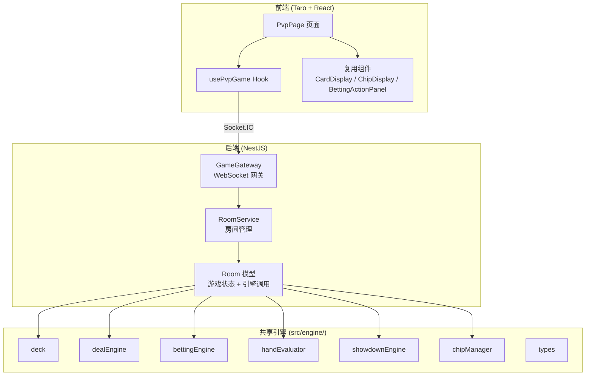
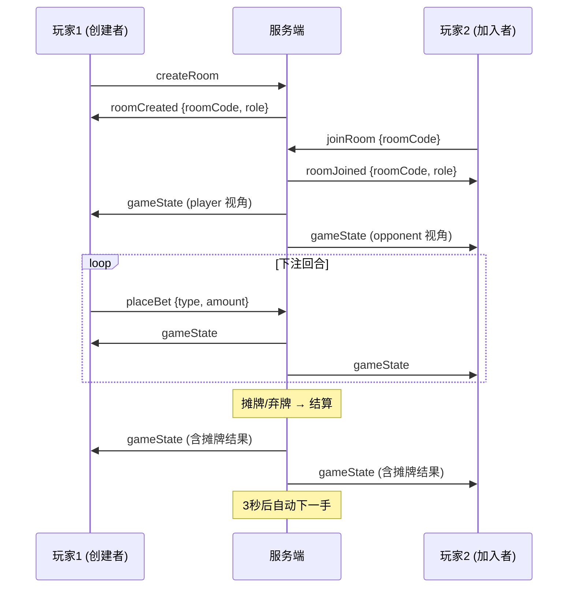

# PVP 对战模式 — 设计文档

## 概述

PVP 对战模式为德州扑克训练器新增 1v1 实时对战能力。系统采用权威服务器架构：NestJS 后端（`server/`）全权管理牌组、发牌、下注、摊牌等核心逻辑，前端（Taro + React）仅负责展示和发送操作指令。

核心设计决策：
- **复用现有引擎**：后端通过 TypeScript path alias `@engine/*` 直接引用 `src/engine/` 中的纯函数模块（deck、dealEngine、bettingEngine、handEvaluator、showdownEngine、chipManager），避免代码重复
- **Socket.IO 通信**：基于 `@nestjs/websockets` + `@nestjs/platform-socket.io` 实现双向实时通信，利用 Socket.IO Room 机制隔离房间
- **视角过滤**：服务端为每位玩家生成独立的 `ClientView`，非摊牌阶段隐藏对手手牌和剩余牌组
- **前端组件复用**：对战界面复用 CardDisplay、ChipDisplay、BettingActionPanel、ResultPanel、GameOverPanel 等现有组件

## 架构

### 整体架构



### 通信流程



## 组件与接口

### 后端模块

#### 1. GameGateway（WebSocket 网关）

已有实现位于 `server/src/room/game.gateway.ts`。

**监听的客户端事件：**
| 事件名 | 参数 | 说明 |
|--------|------|------|
| `createRoom` | 无 | 创建新房间 |
| `joinRoom` | `{ roomCode: string }` | 加入房间 |
| `placeBet` | `{ type: BettingActionType, amount: number }` | 下注操作 |
| `restartGame` | 无 | 游戏结束后重新开始 |
| `reconnect` | `{ roomCode: string, oldSocketId: string }` | 断线重连 |

**发送的服务端事件：**
| 事件名 | 数据 | 说明 |
|--------|------|------|
| `roomCreated` | `{ roomCode, role }` | 房间创建成功 |
| `roomJoined` | `{ roomCode, role }` | 加入房间成功 |
| `gameState` | `ClientView` | 玩家视角的游戏状态 |
| `reconnected` | `{ role }` | 重连成功 |
| `opponentDisconnected` | 无 | 对手断线 |
| `opponentAbandoned` | 无 | 对手放弃（超时未重连） |
| `error` | `{ message: string }` | 错误信息 |

**职责：**
- 接收客户端事件，委托 RoomService 处理
- 输入校验：验证事件参数类型和范围
- 权限校验：验证操作者是否为房间成员、是否为当前行动方
- 通过 `broadcastState()` 向房间内每位玩家发送各自视角的 `ClientView`
- 管理操作超时计时器

#### 2. RoomService（房间管理服务）

已有实现位于 `server/src/room/room.service.ts`。

**核心方法：**
- `createRoom()`: 创建房间，生成唯一 6 位房间码
- `joinRoom(roomCode, socketId)`: 加入房间
- `getRoomBySocket(socketId)`: 通过 socket ID 查找房间
- `handleDisconnect(socketId)`: 处理断线，保留会话
- `handleReconnect(roomCode, oldSocketId, newSocketId)`: 处理重连
- `removeRoom(roomCode)`: 销毁房间

**内部数据结构：**
- `rooms: Map<string, Room>` — 房间码到房间实例的映射
- `socketToRoom: Map<string, string>` — socket ID 到房间码的映射

#### 3. Room 模型

已有实现位于 `server/src/room/room.model.ts`。

**核心职责：**
- 维护完整的 `RoomState`（游戏状态）
- 调用共享引擎模块执行游戏逻辑
- 生成玩家视角的 `ClientView`（`getStateForRole()`）
- 管理玩家连接状态和操作超时

### 前端模块

#### 1. usePvpGame Hook

已有实现位于 `src/hooks/usePvpGame.ts`。

**状态管理：**
- `status`: 连接状态（idle → creating/joining → waiting → playing → disconnected）
- `roomCode`: 当前房间码
- `gameState`: 服务端推送的 `ClientView`
- `errorMsg`: 错误信息

**暴露方法：**
- `createRoom()`: 发送 createRoom 事件
- `joinRoom(code)`: 发送 joinRoom 事件
- `placeBet(action)`: 发送 placeBet 事件
- `restartGame()`: 发送 restartGame 事件

**重连机制：**
- 连接建立时检查 localStorage 中的 `pvp_room` 和 `pvp_socket_id`
- 若存在且 socket ID 不同，自动发送 reconnect 事件

#### 2. PvpPage 页面

已有实现位于 `src/pages/pvp/index.tsx`。

根据 `status` 渲染不同界面：
- `idle/creating/joining`: 大厅界面（创建房间、输入房间码加入）
- `waiting`: 等待对手界面（显示房间码）
- `disconnected`: 断线重连界面
- `playing`: 对战界面（复用 CardDisplay、ChipDisplay、BettingActionPanel、ResultPanel、GameOverPanel）

## 数据模型

### PlayerInfo

```typescript
type PlayerRole = 'player' | 'opponent';

interface PlayerInfo {
  socketId: string;
  role: PlayerRole;
  connected: boolean;
  disconnectedAt: number | null;
}
```

### RoomState（服务端完整状态）

```typescript
interface RoomState {
  phase: ExtendedGamePhase;
  playerHand: Card[];
  opponentHand: Card[];
  communityCards: Card[];
  remainingDeck: Card[];
  chipState: ChipState;
  bettingRound: BettingRoundState | null;
  handNumber: number;
  isGameOver: boolean;
  gameOverWinner: PlayerRole | null;
  showdownResult: ShowdownResult | null;
  actionLog: ActionLogEntry[];
}
```

### ClientView（发送给客户端的视角数据）

```typescript
interface ClientView {
  roomCode: string;
  myRole: PlayerRole;
  myHand: Card[];
  opponentHand: Card[] | null;       // 非摊牌阶段为 null
  communityCards: Card[];
  chipState: ChipState;
  bettingRound: BettingRoundState | null;
  phase: ExtendedGamePhase;
  handNumber: number;
  isGameOver: boolean;
  gameOverWinner: PlayerRole | null;
  showdownResult: ShowdownResult | null;
  actionLog: ActionLogEntry[];
  currentActor: PlayerRole | null;
  availableActions: BettingActionType[];
  opponentConnected: boolean;
}
```

### WebSocket 事件载荷

```typescript
// 客户端 → 服务端
interface CreateRoomPayload {}
interface JoinRoomPayload { roomCode: string }
interface PlaceBetPayload { type: BettingActionType; amount: number }
interface RestartGamePayload {}
interface ReconnectPayload { roomCode: string; oldSocketId: string }

// 服务端 → 客户端
interface RoomCreatedPayload { roomCode: string; role: PlayerRole }
interface RoomJoinedPayload { roomCode: string; role: PlayerRole }
interface ReconnectedPayload { role: PlayerRole }
interface ErrorPayload { message: string }
```

### 关键常量

```typescript
const INITIAL_CHIPS = 2000;
const SMALL_BLIND_AMOUNT = 10;
const BIG_BLIND_AMOUNT = 20;
const MIN_RAISE = 20;
const ACTION_TIMEOUT_MS = 60_000;    // 操作超时 60 秒
const RECONNECT_TIMEOUT_MS = 30_000; // 断线重连超时 30 秒
const AUTO_DEAL_DELAY_MS = 3_000;    // 摊牌后自动发牌延迟 3 秒
```


## 正确性属性（Correctness Properties）

*属性（Property）是在系统所有有效执行中都应成立的特征或行为——本质上是对系统应做什么的形式化陈述。属性是人类可读规格说明与机器可验证正确性保证之间的桥梁。*

### Property 1: 房间码格式与唯一性

*For any* 通过 `createRoom` 创建的房间，其 Room_Code 应恰好为 6 位大写字母数字字符，且在所有活跃房间中不重复。

**Validates: Requirements 3.1, 3.2**

### Property 2: 房间人数上限

*For any* 房间，玩家数量不应超过 2。当房间已满时，任何新的 `joinRoom` 请求应被拒绝并返回错误。

**Validates: Requirements 3.6, 3.7**

### Property 3: 游戏初始状态正确性

*For any* 新初始化的游戏，双方应各持有 2 张手牌，初始筹码为 2000，盲注已发放（底池 = 30），阶段为 `pre_flop_betting`，小盲注方筹码为 1990，大盲注方筹码为 1980。

**Validates: Requirements 5.1, 5.11**

### Property 4: 客户端视角信息隐藏

*For any* 非摊牌阶段的游戏状态，通过 `getStateForRole()` 生成的 ClientView 不应包含对手手牌（opponentHand 为 null）和剩余牌组信息。

**Validates: Requirements 4.4, 9.5**

### Property 5: 摊牌阶段公开手牌

*For any* 处于摊牌阶段的游戏状态，通过 `getStateForRole()` 生成的 ClientView 应包含对手手牌和牌型评估结果。

**Validates: Requirements 4.5**

### Property 6: 游戏阶段有序推进

*For any* 游戏状态序列，阶段应严格按照 `pre_flop_betting → flop_betting → turn_betting → river_betting → showdown` 的顺序推进。每次阶段转换时，公共牌数量应正确增加（翻牌后 3 张、转牌后 4 张、河牌后 5 张）。

**Validates: Requirements 5.2, 5.3**

### Property 7: 非法下注操作不改变状态

*For any* 下注操作，若操作者不是当前行动方、操作类型不在可用操作列表中、或金额不符合规则，则游戏状态应保持不变并返回错误。

**Validates: Requirements 2.3, 2.4, 5.4, 5.5, 9.3, 9.4**

### Property 8: 弃牌结算正确性

*For any* 弃牌操作，未弃牌方应获得当前底池的全部筹码，且双方筹码总和应保持恒定（等于初始总筹码 4000）。

**Validates: Requirements 5.6**

### Property 9: 摊牌结算正确性

*For any* 进入摊牌的游戏，获胜方应获得底池（平局时各得一半），且双方筹码总和应保持恒定。

**Validates: Requirements 5.7**

### Property 10: 全下自动发牌

*For any* 全下后下注回合结束的游戏状态，系统应自动发出所有剩余公共牌（共 5 张）并直接进入摊牌阶段。

**Validates: Requirements 5.8**

### Property 11: 小盲注位置交替

*For any* 手牌序号 n，小盲注位置应为：奇数时 player 为小盲注，偶数时 opponent 为小盲注。

**Validates: Requirements 5.9, 6.4**

### Property 12: 超时默认操作

*For any* 操作超时场景，若当前可用操作包含 check 则自动执行 check，否则自动执行 fold。超时后游戏状态应与手动执行该操作的结果一致。

**Validates: Requirements 7.3, 7.4**

### Property 13: 断线保持状态不变

*For any* 玩家断线事件（在超时期限内），房间和游戏状态应保持不变，断线玩家的 Player_Session 应被保留。

**Validates: Requirements 8.1, 8.5**

### Property 14: 卡牌序列化往返一致性

*For any* 有效的 Card 对象，序列化后再反序列化应产生与原始对象等价的结果。

**Validates: Requirements 13.3**

## 错误处理

### 服务端错误处理

| 场景 | 处理方式 |
|------|----------|
| 加入不存在/已满的房间 | 返回 `error` 事件，message: "房间不存在或已满" |
| 非房间成员发送游戏操作 | 静默忽略（不返回错误，防止信息泄露） |
| 非当前行动方下注 | 返回 `error` 事件，message: "无效操作" |
| 下注参数类型/范围无效 | 返回 `error` 事件，附带具体原因 |
| 重连失败（房间不存在/超时） | 返回 `error` 事件，message: "重连失败，房间不存在或已超时" |
| 非 game_over 阶段发送 restartGame | 静默忽略 |

### 前端错误处理

| 场景 | 处理方式 |
|------|----------|
| Socket.IO 连接失败 | 显示 "网络模块加载失败"，状态设为 error |
| 连接断开 | 状态设为 disconnected，显示 "连接断开，正在尝试重连..." |
| 收到 error 事件 | 在界面上展示错误信息 |
| 收到 opponentAbandoned | 显示 "对手已离开"，状态重置为 idle |

### 超时处理

- 操作超时（60 秒）：自动执行 check 或 fold
- 断线超时（30 秒）：判定放弃，销毁房间，通知对手

## 测试策略

### 测试框架

- **后端单元测试 & 属性测试**：Jest + fast-check（已在 `server/package.json` 中配置）
- **前端单元测试 & 属性测试**：Jest + fast-check（已在根 `package.json` 中配置）
- 每个属性测试至少运行 100 次迭代

### 单元测试覆盖

单元测试聚焦于具体示例和边界情况：

1. **房间管理**：创建房间、加入房间、加入已满房间、加入不存在房间
2. **游戏流程**：初始化、各阶段转换、弃牌结算、摊牌结算、全下处理
3. **WebSocket 事件**：各事件的请求/响应流程
4. **断线重连**：断线保留状态、重连恢复、超时销毁
5. **前端状态管理**：usePvpGame Hook 的状态转换
6. **前端界面**：各状态下的 UI 渲染

### 属性测试覆盖

属性测试验证跨所有输入的通用属性，每个测试对应一个设计属性：

| 属性 | 测试标签 | 测试位置 |
|------|----------|----------|
| Property 1 | Feature: pvp-mode, Property 1: 房间码格式与唯一性 | `server/src/room/__tests__/` |
| Property 2 | Feature: pvp-mode, Property 2: 房间人数上限 | `server/src/room/__tests__/` |
| Property 3 | Feature: pvp-mode, Property 3: 游戏初始状态正确性 | `server/src/room/__tests__/` |
| Property 4 | Feature: pvp-mode, Property 4: 客户端视角信息隐藏 | `server/src/room/__tests__/` |
| Property 5 | Feature: pvp-mode, Property 5: 摊牌阶段公开手牌 | `server/src/room/__tests__/` |
| Property 6 | Feature: pvp-mode, Property 6: 游戏阶段有序推进 | `server/src/room/__tests__/` |
| Property 7 | Feature: pvp-mode, Property 7: 非法下注操作不改变状态 | `server/src/room/__tests__/` |
| Property 8 | Feature: pvp-mode, Property 8: 弃牌结算正确性 | `server/src/room/__tests__/` |
| Property 9 | Feature: pvp-mode, Property 9: 摊牌结算正确性 | `server/src/room/__tests__/` |
| Property 10 | Feature: pvp-mode, Property 10: 全下自动发牌 | `server/src/room/__tests__/` |
| Property 11 | Feature: pvp-mode, Property 11: 小盲注位置交替 | `server/src/engine/__tests__/` |
| Property 12 | Feature: pvp-mode, Property 12: 超时默认操作 | `server/src/room/__tests__/` |
| Property 13 | Feature: pvp-mode, Property 13: 断线保持状态不变 | `server/src/room/__tests__/` |
| Property 14 | Feature: pvp-mode, Property 14: 卡牌序列化往返一致性 | `src/engine/__tests__/` |

### 属性测试库

使用 `fast-check`（已安装），每个属性测试配置 `numRuns: 100`。

每个属性测试必须以注释标注对应的设计属性：
```typescript
// Feature: pvp-mode, Property N: <属性标题>
```
