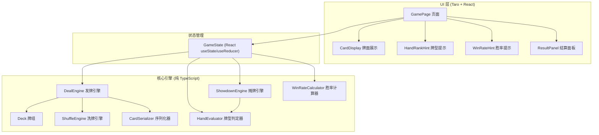
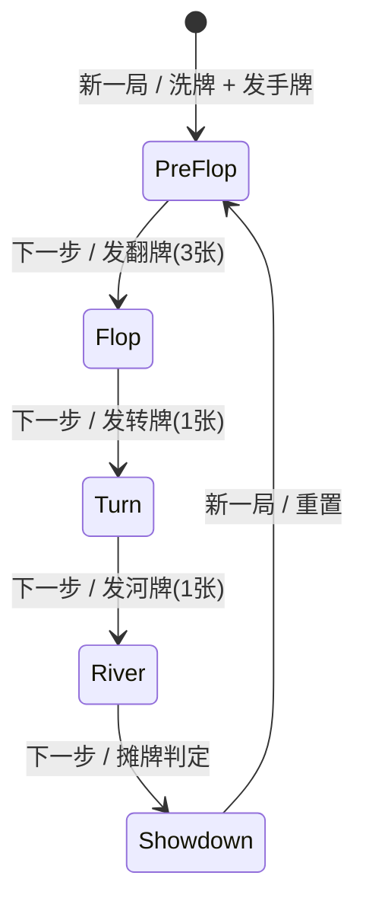

# 技术方案设计文档

## 概述

德州扑克模拟训练器是一款基于 Taro + React + TypeScript 的微信小程序。系统核心是一个无筹码、无下注的简化德州扑克模拟器，玩家与一名"无脑跟注"虚拟对手进行对局。系统实现完整的发牌流程（翻牌前 → 翻牌 → 转牌 → 河牌 → 结算），在河牌后通过牌型判定引擎比较双方最佳五张牌组合，判定胜负。

系统采用纯前端架构，所有逻辑在小程序端完成，不依赖后端服务。核心引擎（洗牌、发牌、牌型判定、胜负比较、胜率计算）与 UI 层解耦，便于独立测试和复用。

### 设计决策

1. **纯前端架构**：所有计算在客户端完成，无需后端服务，降低部署复杂度
2. **引擎与 UI 分离**：核心逻辑（Deck、Deal、HandEvaluator、Showdown）作为纯函数/类实现，不依赖 React 或 Taro API，便于单元测试和属性测试
3. **Fisher-Yates 洗牌**：需求明确指定使用该算法，保证均匀随机性
4. **蒙特卡洛胜率计算**：需求指定至少 1000 次模拟，在小程序环境中性能可接受
5. **JSON 序列化**：Card 对象使用简洁的 JSON 格式进行序列化/反序列化，支持数据持久化

## 架构

### 整体架构



### 牌局流程状态机




## 组件与接口

### 核心引擎模块

#### 1. Card（牌）

```typescript
// 花色枚举
enum Suit {
  Spades = 'S',    // 黑桃
  Hearts = 'H',    // 红心
  Clubs = 'C',     // 梅花
  Diamonds = 'D',  // 方块
}

// 点数枚举 (2-14, 其中 14=A)
enum Rank {
  Two = 2, Three = 3, Four = 4, Five = 5, Six = 6,
  Seven = 7, Eight = 8, Nine = 9, Ten = 10,
  Jack = 11, Queen = 12, King = 13, Ace = 14,
}

interface Card {
  suit: Suit;
  rank: Rank;
}
```

#### 2. Deck（牌组）

```typescript
interface IDeck {
  /** 创建一副完整的 52 张牌 */
  create(): Card[];
  /** 使用 Fisher-Yates 算法洗牌 */
  shuffle(cards: Card[]): Card[];
  /** 从牌组顶部取出 n 张牌，返回 [取出的牌, 剩余的牌] */
  draw(cards: Card[], n: number): [Card[], Card[]];
}
```

#### 3. DealEngine（发牌引擎）

```typescript
interface DealResult {
  playerHand: Card[];       // 玩家手牌 (2张)
  opponentHand: Card[];     // 对手手牌 (2张)
  remainingDeck: Card[];    // 剩余牌组
}

interface IDealEngine {
  /** 发手牌阶段：发出玩家和对手各 2 张底牌 */
  dealHands(deck: Card[]): DealResult;
  /** 发翻牌：从剩余牌组取 3 张 */
  dealFlop(deck: Card[]): [Card[], Card[]];
  /** 发转牌：从剩余牌组取 1 张 */
  dealTurn(deck: Card[]): [Card, Card[]];
  /** 发河牌：从剩余牌组取 1 张 */
  dealRiver(deck: Card[]): [Card, Card[]];
}
```

#### 4. HandEvaluator（牌型判定器）

```typescript
// 牌型等级枚举 (值越大等级越高)
enum HandRankType {
  HighCard = 1,
  OnePair = 2,
  TwoPair = 3,
  ThreeOfAKind = 4,
  Straight = 5,
  Flush = 6,
  FullHouse = 7,
  FourOfAKind = 8,
  StraightFlush = 9,
  RoyalFlush = 10,
}

interface HandEvalResult {
  rankType: HandRankType;       // 牌型等级
  rankName: string;             // 牌型中文名称
  bestCards: Card[];            // 组成最佳牌型的 5 张牌
  /** 用于同等级比较的排序值数组 (包含踢脚牌) */
  compareValues: number[];
}

interface IHandEvaluator {
  /** 从 7 张牌 (2 手牌 + 5 公共牌) 中选出最佳 5 张组合 */
  evaluate(hand: Card[], communityCards: Card[]): HandEvalResult;
  /** 比较两个牌型结果，返回 >0 表示 a 更大，<0 表示 b 更大，0 表示相等 */
  compare(a: HandEvalResult, b: HandEvalResult): number;
}
```

#### 5. ShowdownEngine（摊牌引擎）

```typescript
enum GameResult {
  PlayerWin = 'player_win',
  OpponentWin = 'opponent_win',
  Tie = 'tie',
}

interface ShowdownResult {
  result: GameResult;
  playerEval: HandEvalResult;
  opponentEval: HandEvalResult;
}

interface IShowdownEngine {
  /** 比较玩家和对手的最佳牌型，判定胜负 */
  showdown(
    playerHand: Card[],
    opponentHand: Card[],
    communityCards: Card[],
  ): ShowdownResult;
}
```

#### 6. WinRateCalculator（胜率计算器）

```typescript
interface IWinRateCalculator {
  /**
   * 蒙特卡洛模拟计算胜率
   * @param hand 玩家手牌
   * @param communityCards 已发出的公共牌
   * @param simulations 模拟次数 (默认 1000)
   * @returns 胜率百分比 (整数, 0-100)
   */
  calculate(hand: Card[], communityCards: Card[], simulations?: number): number;
}
```

#### 7. CardSerializer（序列化器）

```typescript
interface ICardSerializer {
  /** Card 对象序列化为 JSON 字符串 */
  serialize(card: Card): string;
  /** JSON 字符串反序列化为 Card 对象 */
  deserialize(json: string): Card;
  /** 批量序列化 */
  serializeMany(cards: Card[]): string;
  /** 批量反序列化 */
  deserializeMany(json: string): Card[];
}
```

### UI 组件

#### 8. GameFlowController（流程控制 Hook）

```typescript
type GamePhase = 'pre_flop' | 'flop' | 'turn' | 'river' | 'showdown';

interface GameStateData {
  phase: GamePhase;
  playerHand: Card[];
  opponentHand: Card[];
  communityCards: Card[];
  remainingDeck: Card[];
  showdownResult: ShowdownResult | null;
  handRankHintEnabled: boolean;
  winRateHintEnabled: boolean;
}

/** React Hook: useGameFlow */
interface UseGameFlowReturn {
  state: GameStateData;
  nextStep(): void;          // 推进到下一阶段
  newGame(): void;           // 开始新一局
  toggleHandRankHint(): void;
  toggleWinRateHint(): void;
}
```

#### 9. CardDisplay（牌面展示组件）

```typescript
interface CardDisplayProps {
  cards: Card[];
  faceDown?: boolean;        // 是否背面朝上
  totalSlots?: number;       // 总占位数 (用于公共牌区域显示背面占位)
  highlightCards?: Card[];   // 需要高亮的牌 (牌型提示)
  label?: string;            // 区域标签 (如 "对手")
}
```

#### 10. HandRankHint（牌型提示组件）

```typescript
interface HandRankHintProps {
  hand: Card[];
  communityCards: Card[];
  enabled: boolean;
}
```

#### 11. WinRateHint（胜率提示组件）

```typescript
interface WinRateHintProps {
  hand: Card[];
  communityCards: Card[];
  enabled: boolean;
}
```

#### 12. ResultPanel（结算面板组件）

```typescript
interface ResultPanelProps {
  result: ShowdownResult;
}
```


## 数据模型

### Card（牌）

| 字段 | 类型 | 说明 |
|------|------|------|
| suit | Suit | 花色: S(黑桃), H(红心), C(梅花), D(方块) |
| rank | Rank | 点数: 2-14 (14=A) |

JSON 序列化格式示例：
```json
{"suit": "S", "rank": 14}
```

### GameStateData（游戏状态）

| 字段 | 类型 | 说明 |
|------|------|------|
| phase | GamePhase | 当前阶段: pre_flop / flop / turn / river / showdown |
| playerHand | Card[] | 玩家手牌 (2张) |
| opponentHand | Card[] | 对手手牌 (2张) |
| communityCards | Card[] | 已发出的公共牌 (0-5张) |
| remainingDeck | Card[] | 剩余牌组 |
| showdownResult | ShowdownResult \| null | 结算结果 |
| handRankHintEnabled | boolean | 牌型提示开关 |
| winRateHintEnabled | boolean | 胜率提示开关 |

### HandEvalResult（牌型判定结果）

| 字段 | 类型 | 说明 |
|------|------|------|
| rankType | HandRankType | 牌型等级 (1-10) |
| rankName | string | 牌型中文名称 |
| bestCards | Card[] | 组成最佳牌型的 5 张牌 |
| compareValues | number[] | 用于同等级比较的排序值数组 |

`compareValues` 编码规则：
- 第一个元素为 `rankType` 值
- 后续元素为该牌型的关键牌点数，按重要性降序排列
- 例如：两对 (K, K, 8, 8, A) → `[3, 13, 8, 14]`
- 例如：顺子 (5-6-7-8-9) → `[5, 9]`（顺子只需最高牌）
- 比较时从左到右逐元素比较，第一个不同的元素决定大小

### ShowdownResult（摊牌结果）

| 字段 | 类型 | 说明 |
|------|------|------|
| result | GameResult | player_win / opponent_win / tie |
| playerEval | HandEvalResult | 玩家最佳牌型 |
| opponentEval | HandEvalResult | 对手最佳牌型 |

### 牌型等级对照表

| 等级值 | 牌型名称 | 说明 |
|--------|----------|------|
| 10 | 皇家同花顺 | 同花色 10-J-Q-K-A |
| 9 | 同花顺 | 同花色连续五张 |
| 8 | 四条 | 四张相同点数 |
| 7 | 葫芦 | 三条 + 一对 |
| 6 | 同花 | 五张同花色 |
| 5 | 顺子 | 连续五张不同花色 |
| 4 | 三条 | 三张相同点数 |
| 3 | 两对 | 两组对子 |
| 2 | 一对 | 一组对子 |
| 1 | 高牌 | 无以上组合 |


## 正确性属性

*属性（Property）是指在系统所有有效执行中都应成立的特征或行为——本质上是对系统应做什么的形式化陈述。属性是人类可读规范与机器可验证正确性保证之间的桥梁。*

### 属性 1：洗牌是一个排列

*对于任意*一副通过 `create()` 生成的 52 张牌组，经过 `shuffle()` 后，结果应包含与原始牌组完全相同的 52 张牌（相同集合，可能不同顺序），且无重复。

**验证需求：1.1, 1.2, 1.3**

### 属性 2：发牌保持牌组完整性

*对于任意*一副洗好的牌组，执行完整的发牌流程（发手牌 → 翻牌 → 转牌 → 河牌）后，所有发出的牌加上剩余牌组应等于原始牌组（相同集合）。

**验证需求：2.1, 2.2, 2.3, 2.4, 2.5, 2.6**

### 属性 3：牌局阶段按固定顺序推进

*对于任意*初始游戏状态，连续调用 `nextStep()` 应按照 pre_flop → flop → turn → river → showdown 的固定顺序推进阶段，且每次推进后公共牌数量应分别为 0、3、4、5、5。

**验证需求：3.1, 3.2**

### 属性 4：新一局重置所有状态

*对于任意*处于任何阶段的游戏状态，调用 `newGame()` 后，阶段应重置为 pre_flop，玩家和对手各持有 2 张新手牌，公共牌为空，结算结果为 null。

**验证需求：3.4, 9.3**

### 属性 5：牌型判定输出不变量

*对于任意* 7 张有效牌（2 张手牌 + 5 张公共牌），`evaluate()` 应返回：rankType 在 1-10 范围内、rankName 非空、bestCards 恰好 5 张且为输入 7 张牌的子集。

**验证需求：4.1, 4.2, 4.3**

### 属性 6：最佳牌型选择的最优性

*对于任意* 7 张有效牌，`evaluate()` 返回的 5 张牌组合的牌型等级应大于或等于从这 7 张牌中任意其他 5 张组合的牌型等级。

**验证需求：4.2**

### 属性 7：牌型比较的传递性和反对称性

*对于任意*三组 7 张牌 a、b、c，若 `compare(eval(a), eval(b)) > 0` 且 `compare(eval(b), eval(c)) > 0`，则 `compare(eval(a), eval(c)) > 0`（传递性）。且 `compare(a, b)` 的符号应与 `compare(b, a)` 的符号相反（反对称性）。

**验证需求：4.4, 11.2, 11.3**

### 属性 8：Card 序列化往返一致性

*对于任意*有效的 Card 对象，`deserialize(serialize(card))` 应产生与原始 card 等价的对象。

**验证需求：8.1, 8.2, 8.3**

### 属性 9：无效 JSON 反序列化产生错误

*对于任意*无效的 JSON 字符串（格式错误、缺少字段、字段值超出范围），`deserialize()` 应抛出包含描述性信息的错误。

**验证需求：8.4**

### 属性 10：胜率计算范围不变量

*对于任意*有效的手牌和公共牌组合，`calculate()` 返回的胜率应为 0 到 100 之间的整数。

**验证需求：7.1, 7.3**

### 属性 11：摊牌结果一致性

*对于任意*玩家手牌、对手手牌和 5 张公共牌，`showdown()` 应返回有效的 GameResult，且结果与分别对双方调用 `evaluate()` 再 `compare()` 的结果一致。即：若玩家牌型更大则 result 为 player_win，若对手更大则为 opponent_win，若相等则为 tie。

**验证需求：11.1, 11.2, 11.3, 11.4, 11.5**

### 属性 12：结算阶段包含有效结果

*对于任意*完整走完所有阶段（pre_flop 到 showdown）的游戏状态，在 showdown 阶段时 showdownResult 应非 null，且包含双方的有效牌型名称和对局结果。

**验证需求：3.3, 11.6**

### 属性 13：牌型提示与判定器一致

*对于任意*手牌和至少 3 张公共牌的组合，牌型提示功能返回的牌型名称和高亮牌张应与 `HandEvaluator.evaluate()` 的结果完全一致。

**验证需求：6.1**


## 错误处理

### 序列化错误

| 场景 | 处理方式 |
|------|----------|
| JSON 格式不合法 | 抛出 `CardSerializationError`，包含 "Invalid JSON format" 描述 |
| 缺少 suit 或 rank 字段 | 抛出 `CardSerializationError`，包含 "Missing required field: {field}" 描述 |
| suit 值不在 S/H/C/D 范围内 | 抛出 `CardSerializationError`，包含 "Invalid suit value: {value}" 描述 |
| rank 值不在 2-14 范围内 | 抛出 `CardSerializationError`，包含 "Invalid rank value: {value}" 描述 |

### 发牌错误

| 场景 | 处理方式 |
|------|----------|
| 牌组剩余牌数不足 | 抛出 `DealError`，包含 "Not enough cards in deck" 描述 |

### 牌型判定错误

| 场景 | 处理方式 |
|------|----------|
| 输入牌数不足 7 张 | 抛出 `EvaluationError`，包含 "Expected 7 cards, got {n}" 描述 |
| 输入牌中有重复 | 抛出 `EvaluationError`，包含 "Duplicate cards detected" 描述 |

### 流程控制错误

| 场景 | 处理方式 |
|------|----------|
| 在 showdown 阶段调用 nextStep | 忽略操作（不抛出错误），保持当前状态 |

## 测试策略

### 测试框架

- **单元测试**: Jest（Taro 项目默认支持）
- **属性测试**: fast-check（TypeScript 生态中成熟的属性测试库）

### 双重测试方法

本项目采用单元测试与属性测试互补的策略：

- **单元测试**：验证具体示例、边界情况和错误条件
  - A 在顺子中的双重角色（A-2-3-4-5 和 10-J-Q-K-A）
  - 各种已知牌型的判定（如已知的皇家同花顺、葫芦等）
  - 无效 JSON 反序列化的具体错误消息
  - UI 组件在各阶段的渲染状态（翻牌前对手牌背面、结算时翻开等）
  - 集成测试：完整牌局流程从新一局到结算

- **属性测试**：验证跨所有输入的通用属性
  - 每个属性测试对应设计文档中的一个正确性属性
  - 每个属性测试至少运行 100 次迭代
  - 使用 fast-check 的 `fc.assert` 和 `fc.property` API
  - 需要自定义生成器：Card 生成器、7 张不重复牌生成器、完整牌组生成器

### 属性测试标签格式

每个属性测试必须包含注释引用设计文档中的属性：

```typescript
// Feature: texas-holdem-trainer, Property 1: 洗牌是一个排列
test('shuffle is a permutation', () => {
  fc.assert(
    fc.property(fc.constant(null), () => {
      // ...
    }),
    { numRuns: 100 }
  );
});
```

### 自定义生成器

```typescript
// Card 生成器
const cardArb: fc.Arbitrary<Card> = fc.record({
  suit: fc.constantFrom(Suit.Spades, Suit.Hearts, Suit.Clubs, Suit.Diamonds),
  rank: fc.integer({ min: 2, max: 14 }).map(r => r as Rank),
});

// 7 张不重复牌生成器 (用于牌型判定测试)
const sevenUniqueCardsArb: fc.Arbitrary<Card[]> = fc.uniqueArray(cardArb, {
  minLength: 7,
  maxLength: 7,
  comparator: (a, b) => a.suit === b.suit && a.rank === b.rank,
});

// 完整 52 张牌组生成器 (洗牌后)
const shuffledDeckArb: fc.Arbitrary<Card[]> = fc.constant(null).map(() => {
  const deck = createDeck();
  return shuffle(deck);
});
```

### 测试覆盖范围

| 模块 | 单元测试 | 属性测试 |
|------|----------|----------|
| Deck (创建/洗牌) | 基本创建验证 | 属性 1 |
| DealEngine (发牌) | 各阶段发牌数量 | 属性 2 |
| GameFlowController | 阶段推进、新一局 | 属性 3, 4, 12 |
| HandEvaluator | A 的顺子、已知牌型 | 属性 5, 6, 7 |
| CardSerializer | 具体序列化示例、错误消息 | 属性 8, 9 |
| WinRateCalculator | 已知胜率场景 | 属性 10 |
| ShowdownEngine | 已知对局结果 | 属性 11 |
| HandRankHint | 提示内容正确性 | 属性 13 |

